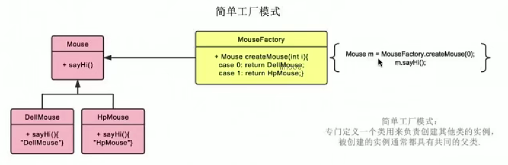
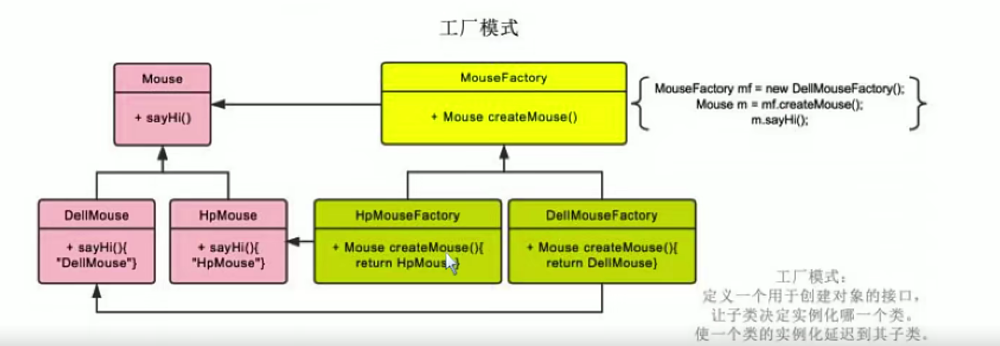
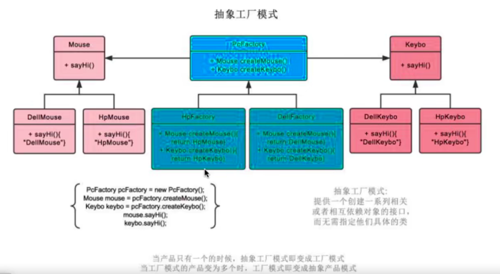
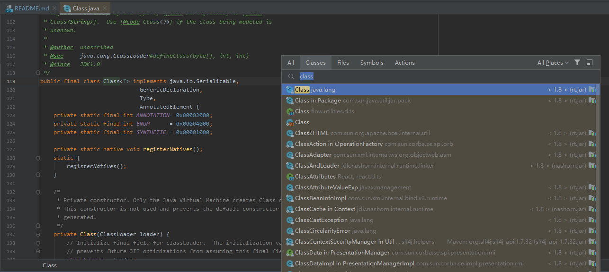
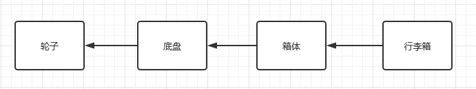
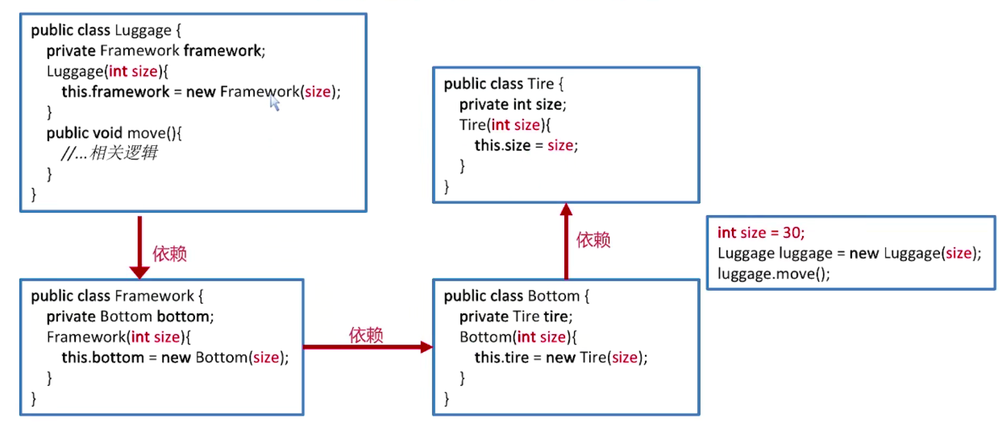
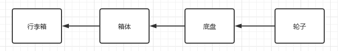
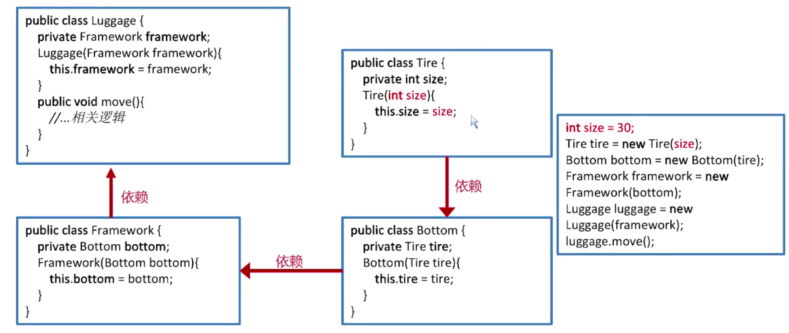
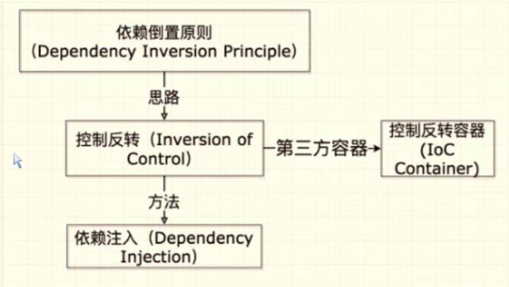

# custom-framework

## 业务系统架子的搭建

- 导入 slf4j-log4j12 和 lombok 的依赖
- 实现 basicobject 相关类（HeadLine 和 ShopCategory）
- 掌握泛型类、泛型接口、泛型方法的使用
- 泛型字母的含义
    - E（Element）：在集合中使用，因为集合中存放的是元素
    - T（Type）：Java类
    - K（key）：键
    - V（Value）：值
    - N（Number）：数值类型

## Service 层代码架子的搭建

- solo 相关类
- combine 相关类：包含多个 solo 相关类，统一对 controller 提供服务

## Controller 层代码架子的搭建

- Servlet
    - 实例化
        - Servlet容器创建Servlet的实例
    - 初始化
        - 该容器调用init()方法 
    - 服务
        - 如果请求Servlet，则容器调用 service()方法
    - 销毁
        - 销毁实例之前调用destroy()方法

- 减少Servlet的数量
    - 一个Servlet对应一个实体类？
        - 职责会不单一
        - 前端发送两次请求给不同的Servlet处理
        - 将两个Servlet合并成一个Servlet
    - 一个Servlet对应一个页面？
        - 若一个页面出现两个Get相同请求，则doGet方法指代不清晰
    - 参考Spring MVC，仅通过DispatcherServlet进行请求派发
        - 拦截所有请求
        - 解析请求
        - 派发给对应的Controller里面的方法进行处理

## 工厂模式

### 简单工厂模式

- 适用场景
    - 需要创建的对象较少
    - 客户端不关心对象的创建过程
- 优点
    - 可以对创建的对象进行“加工”，对客户端隐藏相关细节
- 缺点
    - 因创建逻辑复杂或创建对象过多而造成代码臃肿
- 开闭原则
    - 一个软件实体，应该对扩展开发，对修改关闭
        - 应该通过扩展来实现变化，而不是通过修改已有的代码来实现变化
- 随机应变
    - 所有原则并非一定要严格遵守，而是需要结合业务的实际情况
    


### 工厂方法模式

- 定义一个用于创建对象的接口，让子类决定实例化哪一个类
    - 对类的实例化延迟到其子类
- 优点
    - 遵循开闭原则
    - 对客户端隐藏对象的创建细节
    - 遵循单一职责
- 缺点
    - 添加子类的时候“拖家带口”
    - 只支持同一类产品的创建



### 抽象工厂模式

- 提供一个创建一系列相关或相互依赖对象的接口
    - 抽象工厂模式侧重的是同一产品族
    - 工厂方法模式更加侧重于同一产品等级

- 提供一个创建一系列相关或相互依赖对象的接口，而无需指定他们具体的类
    - 优点：支持多类产品的创建
    - 缺点：违反开闭原则、增加系统复杂度



## 反射

### 反射机制的作用

- 在运行时判断任意一个对象所属的类
- 在运行时获取类的对象
- 在运行时访问java对象的属性、方法、构造方法等

### java.lang.reflect类库里面主要的类

- Field：表示类中的成员变量
- Method：表示类中的方法
- Constructor：表示类的构造方法
- Array：该类提供了动态创建数组和访问数组元素的静态方法

### 反射依赖的Class

- 表示运行时类型信息的对应类
    - 每个类都有唯一一个与之相对应的Class对象
    - Class类为类类型，而Class对象为类类型对象
- Class类的特点 
    - Class 类也是类的一种，class 则是关键字
    - Class 类只有一个私有的构造函数，只有 JVM 能够创建 Class 类的实例
    - JVM 中只有唯一一个和类相对应的 Class 对象来描述其类型信息
- 获取Class对象的三种方式
    - Object  -->  getClass()
    - 任何数据类型（包括基础数据类型）都有一个“静态”的class属性
    - 通过class类的静态方法：forName(String className) (常用)
    
```java
public static void main(String[] args) throws ClassNotFoundException {
    //第一种方式获取class对象
    ReflectTarget reflectTarget = new ReflectTarget();
    Class reflectTargetClass1 = reflectTarget.getClass();
    System.out.println("1==>"+reflectTargetClass1.getName());
    //第二种方式获取class对象
    Class reflectTargetClass2 = ReflectTarget.class;
    System.out.println("2==>"+reflectTargetClass2.getName());
    //第三种方式获取class对象
    Class reflectTargetClass3 = Class.forName("demo.reflect.ReflectTarget");
    System.out.println("3==>"+reflectTargetClass3.getName());
}
/*在运行期，一个类只有一个与之对应的Class对象产生
    1==>demo.reflect.ReflectTarget
    2==>demo.reflect.ReflectTarget
    3==>demo.reflect.ReflectTarget
* */
```

- 获取构造方法并调用：通过Class对象可以获取某个类中的构造方法
    - 批量的方法
        - public Constructor[] getConstructors()：所有"公有的"构造方法 ​ public Constructor[] getDeclaredConstructors()：获取所有的构造方法(包括私有、受保护、默认、公有)
    - 获取单个的方法，并调用
        - public Constructor getConstructor(Class... parameterTypes):获取单个的"公有的"构造方法：
        - public Constructor getDeclaredConstructor(Class... parameterTypes):获取"某个构造方法"可以是私有的，或受保护、默认、 公有；
            - 调用构造方法(如果构造方法是 private 修饰需要先暴力反射)：Constructor-->newInstance(Object... initargs)
- 获取成员变量并调用
    - 批量的
        - Field[] getFields():获取所有的"公有字段"
        - Field[] getDeclaredFields():获取所有字段，包括：私有、受保护、默认、公有；
    - 获取单个的
        - public Field getField(String fieldName):获取某个"公有的"字段；
        - public Field getDeclaredField(String fieldName):获取某个字段(可以是私有的)
    - 设置字段的值(如果成员变量是 private 修饰需要先暴力反射)
        - Field --> public void set(Object obj,Object value):
    - 参数说明
        - obj:要设置的字段所在的对象（非Class对象，是由构造方法生成的）
        - value:要为字段设置的值
- 获取成员方法并调用
    - 批量的
        - public Method[] getMethods():获取所有"公有方法"（包含了父类的方法也包含Object类）
        - public Method[] getDeclaredMethods():获取所有的成员方法，包括私有的(不包括继承的)
    - 获取单个的
        - public Method getMethod(String name,Class<?>... parameterTypes):
        - public Method getDeclaredMethod(String name,Class<?>... parameterTypes)
            - 参数
                - name : 方法名
                - Class ... : 形参的Class类型对象
            - 调用方法(如果成员方法是 private 修饰需要先暴力反射)
                - Method --> public Object invoke(Object obj,Object... args):
            - 参数说明
                - obj : 要调用方法的对象（非Class对象，是由构造方法生成的）
                - args:调用方式时所传递的实参




## 自定义注解 + 反射获取属性

格式：

```java
public @interface 注解名{
    修饰符 返回值 属性名() 默认值;
    修饰符 返回值 属性名() 默认值;
    ...
}
```

- 自定义注解
    - PersonInfoAnnotation
    - CourseInfoAnnotation
    - 作用域 Demo 类   
- 反射获取作用域 Demo 类上面注解属性打印
    - AnnotationParser

### 注解背后底层实现

```java
System.setProperty("jdk.proxy.ProxyGenerator.saveGeneratedFiles", "true");
```

或

```java
-Dsun.misc.ProxyGenerator.saveGeneratedFiles=true
```

根据上述方式，在src同级目录下会多出com.sum.proxy.*.class

- 注解的工作原理
    - 通过键值对的形式为注解属性赋值
    - 编译器检查注解的使用范围，将注解信息写入元素属性表
    - 运行时 JVM 将 RUNTIME 的所有注解属性取出并最终存入 map 里（单个Class文件内所有的RUNTIME的注解而非整个项目的RUNTIME注解）
    - 创建AnnotationInvacationHandler实例并传入前面的map
    - JVM使用JDK动态代理为注解生成动态代理类，并初始化处理器
    - 调用invoke方法，通过传入方法名返回注解对应的属性值


## 上述学习对自研框架的意义

### 控制反转 IoC (Inversion of Controller)

- 依托一个类似工厂的 IoC 容器
- 将对象的创建、依赖关系的管理以及生命周期交由IoC容器管理
- 降低系统在实现上的复杂性和耦合度,易于扩展,满足开闭原则（软件中的对象（类、模块、方法等），对于扩展是开放的，对于修改是封闭的）

> IOC 是 Spring Core最核心部分，它不是一门技术，只是一种编程思想

#### 造行李箱例子



行李箱构成，但是当轮子发生改变大小时，上层的结构都需要改变，这无疑是不可接受的

##### 传统方式建造行李箱



##### 依赖注入DI实现控制反转

应该是下层依赖上层



<br>



### DI 依赖注入

- 构造方法实现注入
- setter实现注入
- 接口实现注入
- 注解实现注入

#### 依靠倒置原则、IoC、DI、IoC容器的关系



### IoC容器的优势

- 避免在各处使用new来创建类 ,并且可以做到统一维护
- 创建实例的时候不需要 了解其中的细节
- 反射+工厂模式的合体,满足开闭原则

> 反射动态生成对象


## 自研框架IoC容器的实现

### 框架具备的基本功能

- 解析配置（XML、注解等）
- 定义和注册对象
- 注入对象
- 提供通用的工具类

### IoC容器的实现

创建注解-->提取标记对象-->实现容器-->依赖注入

#### 仿照Spring创建注解

控制层
```java
// TYPE只作用域类上
@Target(ElementType.TYPE)
// 运行时
@Retention(RetentionPolicy.RUNTIME)
public @interface Controller {
}
```

业务层
```java
// TYPE只作用域类上
@Target(ElementType.TYPE)
// 运行时
@Retention(RetentionPolicy.RUNTIME)
public @interface Service {
}
```

DAO
```java
// TYPE只作用域类上
@Target(ElementType.TYPE)
// 运行时
@Retention(RetentionPolicy.RUNTIME)
public @interface Resipotory {
}
```

Bean
```java
// TYPE只作用域类上
@Target(ElementType.TYPE)
// 运行时
@Retention(RetentionPolicy.RUNTIME)
public @interface Component {
}
```

#### 提取标记对象

- 实现思路
    - 指定范围，获取范围内的所有类
    - 遍历所有类，获取被注解标记的类并加载进容器中

extractPackageClass 方法作用：
1. 获取到类的加载器
2. 通过类加载器获取到加载的资源信息
3. 依据不同的资源类型，采用不同的方式获取资源的集合

- 获取项目加载器目的：
    - 获取项目发布的实际路径，比如：com example

#### 单例模式安全问题

确保一个类只有一个实例，并对外提供统一访问方式
- 饿汉模式
    - 类被加载的时候就立即初始化并创建唯一实例 （线程安全，简单易用）
- 懒汉模式
    - 在被客户端首次调用的时候才创建唯一实例
    - 加入双重检查锁机制懒汉模式能确保线程安全（使用了 synchronized 效率低）
- 反射获取单例
    - 对比直接获取的单例实例与反射得到的单例实例，是否一致   （答案：No）

